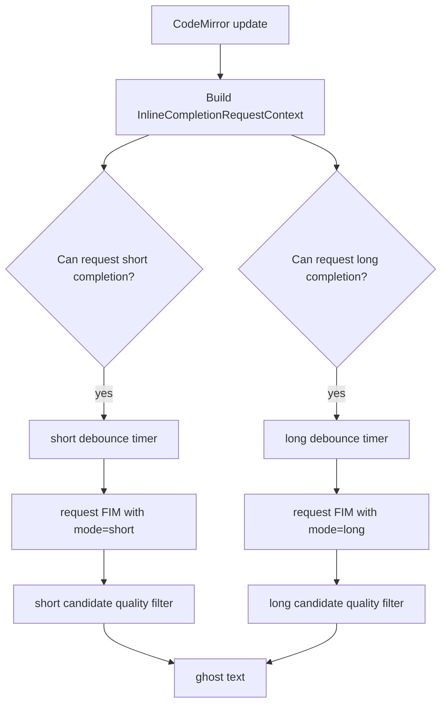

# Write technical description of short completion and inspired long completion

This document describes the dual-mode text completion scheme in Write writing mode. It splits the original single-path ghost text into two writing intentions: short completion in a flow state, and long completion with inspiration when you pause and think.

## Why should we split it into two sets?

Writing completion has two conflicting goals:

- When typing in flow, users need low latency, short, accurate, and non-interruptive input.
- When pausing to think, users need a more complete next sentence or paragraph to help catch their inspiration.

If only one set of strategies is used, two types of problems will arise:

- Trigger too aggressively: long completion interrupts the rhythm being typed.
- The trigger is too conservative: only one or two words are given when the user stops, which lacks heuristic value.

Therefore, the current automatically triggered ghost text path is split into `short` and `long`, which share the editor context and provider service, but use different trigger conditions, prompts, token budgets and quality filtering. The same IPC/service also has a manual `edit` mode for selection-based inline editing; that path is documented in `WRITE_INLINE_EDIT_RAG.en.md`.

## Overall architecture



Core implementation:

- `src/renderer/src/write/inline-completion/codemirror.ts`
- `src/renderer/src/write/inline-completion/policy.ts`
- `src/renderer/src/write/inline-completion/prompt.ts`
- `src/renderer/src/write/inline-completion/feedback.ts`
- `src/main/services/write-inline-completion-service.ts`

## Pattern definition

`WriteInlineCompletionMode` is defined in `src/shared/write-inline-completion.ts`:

```ts
export type WriteInlineCompletionMode = 'short' | 'long' | 'edit'

```

The completion request will carry:

```ts
{
  mode?: 'short' | 'long' | 'edit'
}

```

When mode is not passed, it is regarded as `short` by default to ensure compatibility with old calling paths. This document focuses on the two automatic ghost text modes; `edit` uses the same request type for explicit inline replacement.

## Short completion

Short complement to the heart flow input.

### Trigger conditions

Short completion uses the basic strategy `shouldRequestInlineCompletion`:

- The completion master switch is turned on.
- The current cursor is not a selection.
- The character after the cursor is not a word character.
- The current document has sufficient context.
- Not the URL tail.
- Blank lines need to have structured context or paragraph opportunities.

### Default parameters

| Parameters | Default value | Meaning |
| --- | ---: | --- |
| debounce | 650 ms | Request after how long to stop typing |
| max tokens | 96 | FIM maximum generation length |
| min accept score | 0.52 | local candidate display threshold |
| max visible chars | 220 | ghost text maximum number of characters |
| max visible lines | 6 | ghost text maximum number of lines |
| RAG snippets | 3 | Inject up to 3 retrieved snippets |

### Prompt strategy

Short completion of prompt emphasizes:

- Only the inserted text is returned.
- Prefer to return null when blurred.
- No duplication of suffix.
- Do not diverge new topics.
- Maintain Markdown structure, indentation, and current tone.

### Quality filtering

Short completion is penalized more severely:

- Too long candidate.
- Too many row candidates.
- Duplicate candidate with suffix.
- Candidates for joining words after a complete sentence.
- Overly general beginning.

This makes short completion more like "next string of typing" than AI-active writing.

## Inspirational long completion

The inspiration long complement is oriented towards "give me something to continue writing" after the user pauses.

### Trigger conditions

Long completion is based on the basic conditions of short completion, with additional restrictions:

- Long completion switch is on.
- The cursor must be at the end of the line.
- There is no remaining text after the current line.
- Not in table context.
- Not in title context.
- The current document or local context reaches a higher semaphore.
- When the current line ends with a word character, a longer partial signal is needed to avoid triggering at half a word time.

These restrictions ensure that long completions only appear where the user actually stopped.

### Default parameters

| Parameters | Default value | Meaning |
| --- | ---: | --- |
| debounce | 2800 ms | triggered after a longer pause |
| max tokens | 256 | Allow about one paragraph of continuation inspiration |
| min accept score | 0.36 | looser than short completion |
| max visible chars | 900 | ghost text maximum number of characters |
| max visible lines | 14 | ghost text maximum number of lines |
| RAG snippets | 5 | Inject up to 5 retrieved snippets |

### Prompt strategy

Long completion adds a hidden comment before prompt:

```markdown
<!-- Sino Code inline completion mode: long inspiration.
The user paused at the cursor. Continue the draft with a grounded next thought...
Return only insertable text...
-->

```

It explicitly tells the model:

- Users are pausing for inspiration.
- Can give a more complete next sentence or paragraph.
- Still has to fit the current draft.
- Don't summarize the document.
- Don't generate the entire article.

### Quality filtering

Long completion reuses the duplication detection, sentence boundary detection and generalization penalty of short completion, but relaxes the length limit and lowers the initial threshold.

This way it displays a more complete paragraph while still avoiding the following problems:

- Repeat existing suffix.
- Suddenly opened a new topic.
- The output is too long and the entire content is too long.
- Insert large blocks of text at unsuitable locations.

## Dual timer scheduling

The editor plug-in maintains two timers internally:

- `shortTimer`
- `longTimer`

Every time the document, selection, or focus changes:

1. `sequence += 1`
2. Clear the old timer
3. Recalculate the context
4. If short completion is possible, set a short timer
5. If long completion is possible, set a long timer

When the request returns, it checks:

- Whether the current request id is still the latest sequence.
- Whether the editor state is still the state when the request was made.
- Whether the current cursor position still matches the anchor.

If the user continues to type, the old request will naturally expire, and expired completions will not be inserted into the interface.

## Relationship with RAG

Dual-mode completion and cross-text retrieval are two levels of capabilities:

- Dual mode determines "when to make up, how long to make up, and what strategy to use to make up".
- RAG determines "which cross-text fragments are referenced before completion".

Short completion:

- Pay attention to local smoothness.
- Fewer RAG fragments.
- Candidates are shorter.

Long completion:

- Pay attention to the continuity of inspiration.
- More RAG clips.
- prompt clearly prompts to pause and continue writing.

## Setting items

The settings page provides:

- Enable ghost text completion.
- Cross-text search enhancements.
- FIM API address.
- Complete the model.
- Short completion trigger delay.
- Short completion shows strictness.
- Maximum length of short completion.
- Inspiration long completion switch.
- Inspiration long completion trigger delay.
- Inspired long completion to maximum length.

Default values are defined in `src/shared/app-settings.ts`:

- `DEFAULT_WRITE_INLINE_COMPLETION_DEBOUNCE_MS`
- `DEFAULT_WRITE_INLINE_COMPLETION_MAX_TOKENS`
- `DEFAULT_WRITE_INLINE_COMPLETION_MIN_ACCEPT_SCORE`
- `DEFAULT_WRITE_INLINE_LONG_COMPLETION_DEBOUNCE_MS`
- `DEFAULT_WRITE_INLINE_LONG_COMPLETION_MAX_TOKENS`
- `DEFAULT_WRITE_INLINE_LONG_COMPLETION_MIN_ACCEPT_SCORE`

## User experience principles

The core of this design is "not grabbing the pen":

- Only short completion appears when the user is typing quickly.
- Long completion only appears when the user pauses for a long time.
- Long completion only appears at line ends/paragraph boundaries.
- Tab to accept, Esc to hide.
- Local filtering does not expire and is not displayed.
- Silently disappears when API or retrieval fails.

## Failed to downgrade

Failure in any link will not affect editor input:

- Set Off: Not Requested.
- API Key is missing: the return fails and is not displayed.
- Retrieval failed: degraded to normal FIM.
- FIM failed: not displayed.
- Candidates with low scores: not displayed.
- The user continues to enter: the old request is invalid.

## Test coverage

Related tests:

- `src/main/services/write-inline-completion-service.test.ts`
- `src/main/ipc/app-ipc-schemas.test.ts`
- `src/main/settings-store.test.ts`

Key coverage:

- Automatic short/long ghost text requests use FIM `/completions`; explicit `mode: "edit"` or action-capable requests use chat completions.
- Short completion default mode.
- Long completion uses independent prompt and token budget.
- Set default values ​​for migration.
- IPC schema accepts `mode: "long"` and `mode: "edit"`; the latter is covered by the inline edit tests and docs.

## Follow-up optimization direction

- Add a separate display style to long completion to distinguish between "next string of typing" and "inspirational continuation".
- Added a quieter mode for "only trigger long completion on empty lines".- Automatically adjust long completion debounce with acceptance rate feedback.
- Save independent completion preferences for different writing spaces.
- Increase long completion threshold to reduce divergence when RAG hits are weak.
