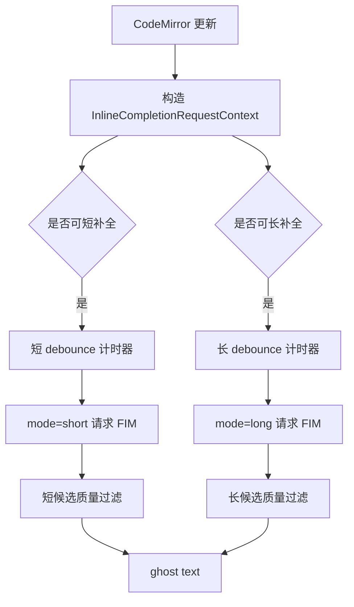

# Write 短补全与灵感长补全技术说明

这份文档说明 Write 写作模式中的双模式文本补全方案。它把原本单一路径的 ghost text 拆成两种写作意图：心流状态下的短补全，以及停顿思考时的灵感长补全。

## 为什么要拆成两套

写作补全有两个互相冲突的目标：

- 心流输入时，用户需要低延迟、短、准、不打扰。
- 停顿思考时，用户需要更完整的下一句或下一段，帮助接住灵感。

如果只用一套策略，会出现两类问题：

- 触发太积极：长补全打断正在输入的节奏。
- 触发太保守：用户停住时只给一两个词，缺少启发价值。

因此当前自动触发的 ghost text 路径拆成 `short` 和 `long` 两个 mode，共享编辑器上下文和服务端请求链路，但使用不同触发条件、prompt、token 预算和质量过滤。同一套 IPC / service 还包含面向选区编辑的手动 `edit` mode，详见 `WRITE_INLINE_EDIT_RAG.zh-CN.md`。

## 总体架构



核心实现：

- `src/renderer/src/write/inline-completion/codemirror.ts`
- `src/renderer/src/write/inline-completion/policy.ts`
- `src/renderer/src/write/inline-completion/prompt.ts`
- `src/renderer/src/write/inline-completion/feedback.ts`
- `src/main/services/write-inline-completion-service.ts`

## 模式定义

`WriteInlineCompletionMode` 定义在 `src/shared/write-inline-completion.ts`：

```ts
export type WriteInlineCompletionMode = 'short' | 'long' | 'edit'
```

补全请求会携带：

```ts
{
  mode?: 'short' | 'long' | 'edit'
}
```

未传 mode 时默认视为 `short`，保证旧调用路径兼容。本文重点说明两个自动 ghost text mode；`edit` 复用同一请求类型承载显式 inline replacement。

## 短补全

短补全面向心流输入。

### 触发条件

短补全使用基础策略 `shouldRequestInlineCompletion`：

- 补全总开关开启。
- 当前光标不是选区。
- 光标后一个字符不是单词字符。
- 当前文档有足够上下文。
- 不是 URL 尾部。
- 空白行需要有结构化上下文或段落机会。

### 默认参数

| 参数 | 默认值 | 含义 |
| --- | ---: | --- |
| debounce | 650 ms | 停止输入多久后请求 |
| max tokens | 96 | FIM 最大生成长度 |
| min accept score | 0.52 | 本地候选显示阈值 |
| max visible chars | 220 | ghost text 最大字符数 |
| max visible lines | 6 | ghost text 最大行数 |
| RAG snippets | 3 | 最多注入 3 个检索片段 |

### Prompt 策略

短补全的 prompt 强调：

- 只返回插入文本。
- 模糊时宁可返回空。
- 不重复 suffix。
- 不发散新主题。
- 保持 Markdown 结构、缩进、当前语气。

### 质量过滤

短补全会更严格地惩罚：

- 过长候选。
- 过多行候选。
- 与 suffix 重复的候选。
- 在完整句子后硬接词的候选。
- 过于泛化的开头。

这让短补全更像“下一串键入”，而不是 AI 主动写作。

## 灵感长补全

灵感长补全面向用户停顿后的“给我一点可继续写的东西”。

### 触发条件

长补全基于短补全基础条件，再增加限制：

- 长补全开关开启。
- 光标必须在行尾。
- 当前行后面没有剩余文本。
- 不在表格上下文中。
- 不在标题上下文中。
- 当前文档或局部上下文达到更高信号量。
- 当前行以单词字符结束时，需要更长局部信号，避免半个词时触发。

这些限制确保长补全只在“用户真的停住了”的地方出现。

### 默认参数

| 参数 | 默认值 | 含义 |
| --- | ---: | --- |
| debounce | 2800 ms | 更长停顿后触发 |
| max tokens | 256 | 允许约一段的续写灵感 |
| min accept score | 0.36 | 比短补全更宽松 |
| max visible chars | 900 | ghost text 最大字符数 |
| max visible lines | 14 | ghost text 最大行数 |
| RAG snippets | 5 | 最多注入 5 个检索片段 |

### Prompt 策略

长补全会在 prompt 前加入隐藏注释：

```markdown
<!-- Sino Code inline completion mode: long inspiration.
The user paused at the cursor. Continue the draft with a grounded next thought...
Return only insertable text...
-->
```

它明确告诉模型：

- 用户是停顿寻求灵感。
- 可以给更完整的下一句或下一段。
- 仍然必须贴合当前草稿。
- 不要总结文档。
- 不要生成整篇文章。

### 质量过滤

长补全复用短补全的重复检测、句边界检测和泛化惩罚，但放宽长度限制，并降低初始阈值。

这样它可以显示更完整的段落，同时仍避免以下问题：

- 重复现有 suffix。
- 突然开新主题。
- 输出过长整篇内容。
- 在不适合的位置插入大段文本。

## 双计时器调度

编辑器插件内部维护两个 timer：

- `shortTimer`
- `longTimer`

每次文档、选区或焦点变化时：

1. `sequence += 1`
2. 清掉旧 timer
3. 重新计算上下文
4. 如果可短补全，设置短 timer
5. 如果可长补全，设置长 timer

请求返回时会检查：

- 当前 request id 是否仍是最新 sequence。
- 编辑器 state 是否仍是发起请求时的 state。
- 当前光标位置是否仍匹配 anchor。

如果用户继续输入，旧请求会自然失效，不会把过期补全插入界面。

## 与 RAG 的关系

双模式补全和跨文本检索是两层能力：

- 双模式决定“什么时候补、补多长、用什么策略补”。
- RAG 决定“补全前参考哪些跨文本片段”。

短补全：

- 注重局部流畅。
- RAG 片段更少。
- 候选更短。

长补全：

- 注重灵感连续。
- RAG 片段更多。
- prompt 明确提示停顿续写。

## 设置项

设置页提供：

- 启用幽灵文本补全。
- 跨文本检索增强。
- FIM API 地址。
- 补全模型。
- 短补全触发延迟。
- 短补全显示严格度。
- 短补全最大长度。
- 灵感长补全开关。
- 灵感长补全触发延迟。
- 灵感长补全最大长度。

默认值定义在 `src/shared/app-settings.ts`：

- `DEFAULT_WRITE_INLINE_COMPLETION_DEBOUNCE_MS`
- `DEFAULT_WRITE_INLINE_COMPLETION_MAX_TOKENS`
- `DEFAULT_WRITE_INLINE_COMPLETION_MIN_ACCEPT_SCORE`
- `DEFAULT_WRITE_INLINE_LONG_COMPLETION_DEBOUNCE_MS`
- `DEFAULT_WRITE_INLINE_LONG_COMPLETION_MAX_TOKENS`
- `DEFAULT_WRITE_INLINE_LONG_COMPLETION_MIN_ACCEPT_SCORE`

## 用户体验原则

这套设计的核心是“不抢笔”：

- 用户正在快速输入时，只出现短补全。
- 用户停顿较久时，才出现长补全。
- 长补全只在行尾/段落边界出现。
- Tab 接受，Esc 隐藏。
- 本地过滤不过时不展示。
- API 或检索失败时静默消失。

## 失败降级

任意环节失败都不会影响编辑器输入：

- 设置关闭：不请求。
- API Key 缺失：返回失败，不显示。
- 检索失败：退化为普通 FIM。
- FIM 失败：不显示。
- 候选低分：不显示。
- 用户继续输入：旧请求失效。

## 测试覆盖

相关测试：

- `src/main/services/write-inline-completion-service.test.ts`
- `src/main/ipc/app-ipc-schemas.test.ts`
- `src/main/settings-store.test.ts`

重点覆盖：

- 自动 short/long ghost text 请求走 FIM `/completions`；显式 `mode: "edit"` 或可能返回 action 的请求走 chat completions。
- 短补全默认 mode。
- 长补全使用独立 prompt 和 token budget。
- 设置默认值迁移。
- IPC schema 接受 `mode: "long"` 和 `mode: "edit"`；后者由 inline edit 测试和文档覆盖。

## 后续优化方向

- 给长补全增加单独的显示样式，区别“下一串键入”和“灵感续写”。
- 增加“只在空行触发长补全”的更安静模式。
- 用接受率反馈自动调整长补全 debounce。
- 为不同写作空间保存独立补全偏好。
- 在 RAG 命中较弱时，提高长补全阈值，减少发散。
