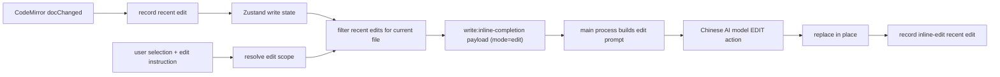

# Write text editor's Recent Edits intent context

This document explains the "recent edit context" capability added this round. The problem it solves is: after the user has just made a series of edits, and then selects a piece of text for AI to edit, the model should know "what happened in the last second", so as to better understand weak instructions such as "continue to change like this", "replace similarly" and "keep this style".

## Background

The previous version of inline edit already had three types of context:

- `prefix/suffix`: provider context around the editable range.
- `original`: the current selection or paragraph to be replaced.
- BM25 + Keyword RAG: Recall terms, facts and style fragments from other documents in the writing space.

These contexts can explain "what the current paragraph is", but they cannot explain "how the user just changed it". For example:

1. The user manually changes the first `Sino Code` to `Write mode`.
2. The user selects another word in the same paragraph and enters "Continue to change like this".

Without recent edits, the model can only guess what "such" means. New ability to inject recent edits into the prompt as an intent signal.

## Data collection

The collection point is `updateListener` of CodeMirror:

- Only log real document changes `docChanged`.
- Full replacement caused by external synchronization will be excluded through `externalValueSyncAnnotation`.
- Each change records deleted text, inserted text, left neighborhood of the old document, and right neighborhood of the new document.
- After the AI ​​in-place editing application is successful, an edit from the `inline-edit` source will be manually recorded, because such changes are synchronized back to the editor through the React value and will not be recorded as user input by CodeMirror.

## Deterministic term propagation

In addition to leaving recent edits to the model for understanding, this round also adds a rigid capability that does not depend on the model: **same paragraph term propagation**.

When a user replaces one phrase with another all at once, for example:

```text
Sino Code -> Sino Code
Sino Code -> DXGUI

```

The editor will search for other case-insensitive identical phrases in the current natural paragraph and replace them synchronously. This solves the basic text editing experience of "I just changed this to uppercase, and everything else should also be uppercase."

In order to avoid accidental injury, there are these restrictions on dissemination:

- Propagate only within the same natural paragraph, not across blank lines, headers, code fences and separators.
- Only handles one-time phrase replacement, not normal verbatim input.
- The phrase must be morphologically similar to a term, such as being long enough, containing spaces, uppercase and lowercase letters, numbers, underscores, or hyphens.
- Will check word boundaries to avoid accidentally replacing local strings in `mySino Code`.

Record structure:

```ts
type WriteRecentEdit = {
  source: 'user' | 'inline-edit'
  timestamp: number
  filePath: string
  from: number
  to: number
  deletedText: string
  insertedText: string
  beforeContext: string
  afterContext: string
  instruction?: string
  scopeKind?: 'selection' | 'paragraph'
}

```

## Noise control

Recent edits are short-term, lightweight, in-memory context and are not persisted.

Current strategy:

- Keep up to 48 entries.
- TTL is 2 minutes.
- Continuous typing will be merged into a single record within a 3 second window to avoid splitting a term into multiple single character signals.
- Single deletion/insertion of text will be length-cropped.
- When constructing the inline edit payload, only the current file is taken.
- The sorting will combine "the newer, the more important" and "the closer to the current editing range, the more important".
- Inject up to 8 bars.

This can overwrite "what was changed in the last second" and avoid mistaking editing habits long ago for current intentions.

## Prompt injection

The main process adds a `Recent local edits` block to the provider prompt. For automatic short/long completions this is part of the hidden Markdown comment; for explicit edit requests it is included in the chat action prompt.

```markdown
<!-- Sino Code inline edit.
...
User instruction: keep editing like this

Recent local edits in this file. Treat these as intent signals...

[1] 2s ago; source=user; range=20-32
Deleted: Sino Code
Inserted: Write mode
Around: Earlier term: [[edit]] should be consistent.

Original edit scope:
...
-->

```

At the same time, the system constraints are clearly stated:

- recent edits is an intent signal, not a forced copy.
- Intent can be inferred from recent edits when the user says "continue", "the same", "like this".
- If recent edits conflict with the current command, the current command takes precedence.

## Troubleshooting dashboard

In order to locate "why the model is not edited/completed as expected", an AI writing call log pop-up window has been added to the Write mode area of the settings page. Inline edit and inline completion both call `write:inline-completion`; edit requests are recorded as `mode: "edit"` in the main process memory. The user can refresh and view recent records, or clear them with one click.

Text editing record display:

- The actual provider `prompt` or chat messages.
- The tracked `suffix` / trailing context.
- Original editing scope `original`.
- Model raw return `rawResponse`.
- Parsed `replacement`.
- Model used, time taken, number of RAG fragments, number of recent edits and error message.

Text completion record display:

- The actual provider `prompt`.
- The tracked `suffix`.
- Model raw return `rawResponse`.
- Parsed `completion`.
- Completion mode, model, time taken, number of RAG fragments and error messages.

This can distinguish three types of problems:

- Prompt did not make the "uniform terminology/case" clear.
- The model returned does not obey the replacement-only constraint.
- Application layer replacement scope or deterministic propagation logic does not take effect.

## Relationship with RAG

BM25 + keywords RAG and recent edits to solve different problems:

- RAG is responsible for cross-document fact, terminology, and style recall.
- Recent edits is responsible for the editing intentions that just occurred in the current file.

In implementation, recent edits will also participate in retrieval query construction. That is, after a user has just replaced an old term with a new term, it will be easier for subsequent editors to recall reference fragments containing the new term.

## Application link



## Implementation files

- `src/renderer/src/write/recent-edits.ts`: recent edit creation, cropping, TTL, filtering and sorting.
- `src/renderer/src/write/term-propagation.ts`: Term case/rename propagation in the same paragraph.
- `src/renderer/src/components/write/WriteMarkdownEditor.tsx`: Collect user edits from CodeMirror transaction.
- `src/renderer/src/write/write-workspace-store.ts`: Save recent edits.
- `src/renderer/src/write/inline-edit.ts`: Put recent edits into inline edit payload.
- `src/main/services/write-inline-completion-service.ts`: Inject recent edits into edit/completion prompts, participate in RAG query, parse the returned action, and record the shared debug log.
- `src/renderer/src/components/SettingsView.tsx`: Display text editing/completion call log pop-up window.
- `src/shared/write-inline-edit.ts`: Shared payload type.

## Test coverage

- Creation of recent edits, TTL filtering, current file filtering.
- Same paragraph term propagation and word boundary protection.
- `write:inline-completion` payloads with `mode: "edit"` can carry recent edits.
- IPC schema accepts structured recent edits.
- Provider prompts contain the recent edits intent signal.

## Follow-up direction

- Merge continuous typing into coarser-grained editing segments to reduce prompt noise.
- Automatically adjust the weight of recent edits according to instructions, for example, "Same as above" relies more on history, "Rewrite this paragraph" relies more on the current selection.
- Added diff preview to allow users to confirm before applying replacement.
