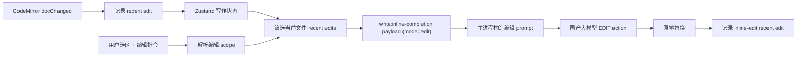

# Write 文本编辑的 Recent Edits 意图上下文

这份文档说明本轮新增的“最近编辑上下文”能力。它解决的问题是：用户刚刚做过一串编辑后，再选中一段文字让 AI 编辑时，模型应该知道“上一秒发生了什么”，从而更好地理解“继续这样改”“同样替换”“保持这个风格”这类弱指令。

## 背景

上一版 inline edit 已经具备三类上下文：

- `prefix / suffix`：可编辑范围前后的 provider 上下文。
- `original`：当前要替换的选区或段落。
- BM25 + 关键词 RAG：从写作空间其他文件召回术语、事实和风格片段。

这些上下文能解释“当前段落是什么”，但不能解释“用户刚刚在怎么改”。例如：

1. 用户手动把第一处 `Sino Code` 改成 `Write mode`。
2. 用户又选中同一段里的另一个词，输入“继续这样改”。

没有 recent edits 时，模型只能猜“这样”指什么。新增能力会把最近编辑作为意图信号注入 prompt。

## 数据采集

采集点在 CodeMirror 的 `updateListener`：

- 只记录真实文档变化 `docChanged`。
- 外部同步产生的全量替换会通过 `externalValueSyncAnnotation` 排除。
- 每次 change 记录删除文本、插入文本、旧文档左侧邻域、新文档右侧邻域。
- AI 原地编辑应用成功后，会手动记录一条 `inline-edit` 来源的 edit，因为这类变更通过 React value 同步回编辑器，不会被 CodeMirror 当作用户输入记录。

## 确定性术语传播

除了把 recent edits 交给模型理解，本轮还补了一个不依赖模型的刚性能力：**同段术语传播**。

当用户一次性把一个短语替换成另一个短语时，例如：

```text
Sino Code -> Sino Code
Sino Code -> DXGUI
```

编辑器会在当前自然段内查找其他大小写不敏感的同短语，并同步替换。这解决的是“我刚把这里改成大写，其他地方也应该变成大写”的基础文本编辑体验。

为了避免误伤，传播有这些限制：

- 只在同一自然段内传播，不跨空行、标题、代码围栏和分隔线。
- 只处理一次性短语替换，不处理普通逐字输入。
- 要求短语形态足够像术语，例如长度足够、包含空格、大小写、数字、下划线或连字符。
- 会检查词边界，避免把 `mySino Code` 里的局部字符串误替换。

记录结构：

```ts
type WriteRecentEdit = {
  source: 'user' | 'inline-edit'
  timestamp: number
  filePath: string
  from: number
  to: number
  deletedText: string
  insertedText: string
  beforeContext: string
  afterContext: string
  instruction?: string
  scopeKind?: 'selection' | 'paragraph'
}
```

## 噪声控制

Recent edits 是短期、轻量、内存态上下文，不做持久化。

当前策略：

- 最多保留 48 条。
- TTL 为 2 分钟。
- 连续打字会在 3 秒窗口内合并成一条记录，避免把一个术语拆成多个单字符信号。
- 单条删除/插入文本会做长度裁剪。
- 构造 inline edit payload 时，只取当前文件。
- 排序会综合“越新越重要”和“离当前编辑范围越近越重要”。
- 最多注入 8 条。

这能覆盖“上一秒改了什么”，同时避免把长时间以前的编辑习惯误当成当前意图。

## Prompt 注入

主进程会把 `Recent local edits` 区块加入 provider prompt。自动 short/long 补全会放进隐藏 Markdown comment；显式 edit 请求会放进 chat action prompt。

```markdown
<!-- Sino Code inline edit.
...
User instruction: 继续这样改

Recent local edits in this file. Treat these as intent signals...

[1] 2s ago; source=user; range=20-32
Deleted: Sino Code
Inserted: Write mode
Around: Earlier term: [[edit]] should be consistent.

Original edit scope:
...
-->
```

同时系统约束明确说明：

- recent edits 是 intent signal，不是强制复制。
- 当用户说“继续”“同样”“照这样”时，可以从 recent edits 推断意图。
- 如果 recent edits 和当前指令冲突，优先当前指令。

## 排障看板

为了定位“模型为什么没按预期编辑/补全”，设置页的 Write 模式区域新增了 AI 写作调用日志弹窗。inline edit 和 inline completion 都复用 `write:inline-completion` 调用；编辑请求会以 `mode: "edit"` 记录在主进程内存中，用户可以刷新查看最近记录，也可以一键清空。

文本编辑记录展示：

- 实际发送给 provider 的 `prompt` 或 chat messages。
- 记录的 `suffix` / 后置上下文。
- 原始编辑范围 `original`。
- 模型原始返回 `rawResponse`。
- 解析后的 `replacement`。
- 使用的模型、耗时、RAG 片段数、recent edits 数量和错误信息。

文本补全记录展示：

- 实际发送给 provider 的 `prompt`。
- 记录的 `suffix`。
- 模型原始返回 `rawResponse`。
- 解析后的 `completion`。
- 补全模式、模型、耗时、RAG 片段数和错误信息。

这样可以区分三类问题：

- Prompt 没把“统一术语/大小写”说清楚。
- 模型返回没有遵守 replacement-only 约束。
- 应用层替换范围或确定性传播逻辑没有生效。

## 与 RAG 的关系

BM25 + 关键词 RAG 和 recent edits 解决不同问题：

- RAG 负责跨文件事实、术语、风格召回。
- Recent edits 负责当前文件里刚发生的编辑意图。

实现上，recent edits 也会参与检索查询构造。也就是说，用户刚把一个旧术语替换成新术语后，后续编辑会更容易召回包含新术语的参考片段。

## 应用链路



## 落地文件

- `src/renderer/src/write/recent-edits.ts`：recent edit 创建、裁剪、TTL、筛选和排序。
- `src/renderer/src/write/term-propagation.ts`：同段术语大小写/重命名传播。
- `src/renderer/src/components/write/WriteMarkdownEditor.tsx`：从 CodeMirror transaction 采集用户编辑。
- `src/renderer/src/write/write-workspace-store.ts`：保存 recent edits。
- `src/renderer/src/write/inline-edit.ts`：把 recent edits 放入 inline edit payload。
- `src/main/services/write-inline-completion-service.ts`：把 recent edits 注入编辑/补全 prompt，参与 RAG 查询，解析返回 action，并记录共享调试日志。
- `src/renderer/src/components/SettingsView.tsx`：展示文本编辑/补全调用日志弹窗。
- `src/shared/write-inline-edit.ts`：共享 payload 类型。

## 测试覆盖

- recent edits 的创建、TTL 过滤、当前文件过滤。
- 同段术语传播和词边界保护。
- `mode: "edit"` 的 `write:inline-completion` payload 能携带 recent edits。
- IPC schema 接受结构化 recent edits。
- provider prompt 会包含 recent edits intent signal。

## 后续方向

- 把连续打字合并成更粗粒度的编辑片段，减少 prompt 噪声。
- 根据指令自动调整 recent edits 权重，例如“同上”更依赖历史，“重写这段”更依赖当前选区。
- 增加 diff preview，让用户在应用 replacement 前确认。
